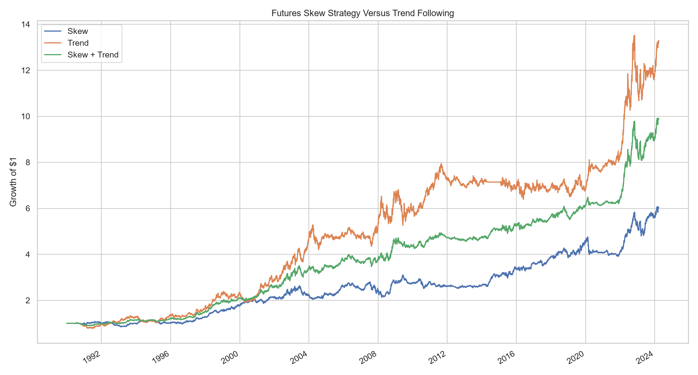

# Laurier Trading Group Research

Quantitative market research, strategy development, and backtesting projects.

## Futures Skew Analysis

This project tests whether recent realized skewness contains information about subsequent futures returns. The strategy ranks markets by rolling skew, takes long exposure toward negatively skewed contracts and short exposure toward positively skewed contracts, and scales positions by volatility. Its performance is evaluated independently, against a conventional 12-month trend-following strategy, and in a 50/50 combined portfolio.

The study covers 15 futures markets across equity indices, government bonds, energy, metals, agriculture, and currencies. Historical coverage begins in 1990 where available and ends on March 28, 2024.

## Main results

Returns below are arithmetic annualized returns after the modelled baseline transaction cost of one basis point per unit of turnover.

| Strategy | Annualized return | Volatility | Sharpe ratio | Maximum drawdown | Positive years |
| --- | ---: | ---: | ---: | ---: | ---: |
| Skew | 5.47% | 9.81% | 0.557 | -23.84% | 68.57% |
| 12-month trend | 8.03% | 12.48% | 0.644 | -23.30% | 68.57% |
| 50% skew / 50% trend | 6.71% | 8.29% | 0.809 | -17.40% | 80.00% |

The combined portfolio produced the strongest risk-adjusted result in the historical sample because skew and trend were imperfectly correlated. These figures are research outputs, not live performance.



## Kill-switch experiment

A separate experiment moves the skew strategy to cash after either a 15% shadow drawdown or 20% annualized 20-day volatility. It waits at least 20 trading days and requires both drawdown and volatility to recover before re-entering.

| Version | Annualized return | Volatility | Sharpe ratio | Maximum drawdown | Time active | Activations |
| --- | ---: | ---: | ---: | ---: | ---: | ---: |
| Original skew | 5.47% | 9.81% | 0.557 | -23.84% | 100.0% | 0 |
| With kill switch | 2.99% | 7.97% | 0.375 | -26.02% | 64.8% | 12 |

In this sample, the kill switch reduced volatility but also lowered returns and failed to improve maximum drawdown.

## Methodology

- Construct daily futures returns from changes in back-adjusted prices divided by the current contract price.
- Estimate rolling realized skew over 126-day and 252-day windows.
- Convert each market's skew into a cross-sectional rank and reverse the sign.
- Smooth the signals, scale positions inversely to recent volatility, and combine the two lookbacks equally.
- Target 10% portfolio volatility with a maximum gross leverage of 4.0.
- Apply a one-day signal delay to avoid look-ahead bias.
- Compare performance across transaction costs, subperiods, crises, instruments, asset classes, and alternative parameters.
- Evaluate statistical uncertainty with Newey-West tests and a 2,000-repetition moving-block bootstrap.

## Repository contents

```text
.
├── skew_analysis.ipynb          # Main research notebook and baseline backtest
├── advanced_tests.py            # Robustness, attribution, and statistical tests
├── futures_skew_dashboard.py    # Terminal dashboard for saved results
├── outputs/                     # Selected figures and result tables
├── requirements.txt             # Python dependencies
└── .gitignore
```

Raw and processed market data are downloaded locally and excluded from version control. The notebook uses the public futures files in the [pysystemtrade repository](https://github.com/pst-group/pysystemtrade/tree/master/data/futures), whose bundled snapshot ends on March 28, 2024.

## Reproduce the analysis

Using Python 3.13 or a compatible recent Python release:

```bash
python -m venv .venv
```

Activate the environment on Windows:

```powershell
.venv\Scripts\Activate.ps1
```

Install the dependencies:

```bash
python -m pip install --upgrade pip
python -m pip install -r requirements.txt
```

Open `skew_analysis.ipynb` in VS Code or Jupyter and run its cells in order. The notebook downloads the market data, constructs returns, runs the baseline analysis, and writes its results to `outputs/`.

Run the additional robustness tests:

```bash
python advanced_tests.py
```

View the saved results in the terminal dashboard:

```bash
python futures_skew_dashboard.py --data-dir outputs
```

## Important limitations

This is an historical backtest over a limited universe. Results remain sensitive to data quality, instrument selection, parameter choices, transaction-cost assumptions, and the difference between simulated and executable prices. Financing costs, taxes, margin constraints, and full market impact are not modelled.

This repository is provided for research and educational purposes only. It is not investment advice.
